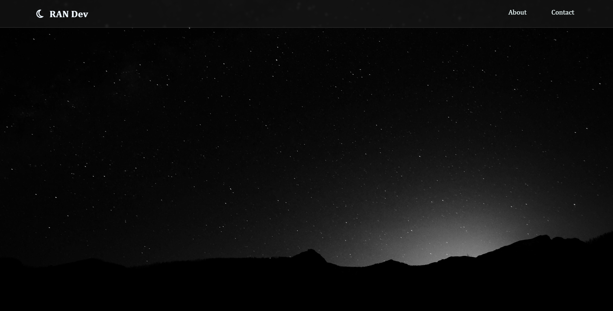

# Personal Portfolio - Rajan (RAN) Dev

This is a display of personal information and projects done/contributed. 

## Table of contents

- [Overview](#overview)
  - [Built with](#built-with)
  - [Continued development](#continued-development)
  - [Useful resources](#useful-resources)
- [Author](#author)

## Overview

This is a simple informative page that shows my projects/exercises and this includes the contact links.

### Screenshot

### Built with

- Semantic HTML5 markup
- CSS custom properties
- Flexbox
- Responsive characteristic
- GSAP
- CSS Animation
- Basic JS animation

### Continued development

There are a lot of aspects in which needs development. Making a fully responsive page, to pleasing designs and color palettes, informative contents; There's a lot more to know and practice.

### Useful resources

- [CSS Responsive Concepts](https://www.youtube.com/watch?v=TUD1AWZVgQ8) - This helped me to understand to concept of flex display. I really liked this pattern and will use it going forward.

- [Color Hunt](https://colorhunt.co/palette) - This significantly help me visualize the colors that works well and compliments each other in a project.

- [Website do's and don'ts](https://www.youtube.com/watch?v=czA0x2kjpKQ) - Practices in making a proper website design.

## Author
Rajan Paul Francisco - training in Frontend | Web Dev

Web Platform Accounts

- [GitHub](https://github.com/rajan-paul)

- [LinkedIn](https://www.linkedin.com/in/rajan-paul-francisco-5241ba278/)

- [ResumeLink by Jobs180](https://jobseekers.jobs180.com/resume/resumelink#[object%20Object])